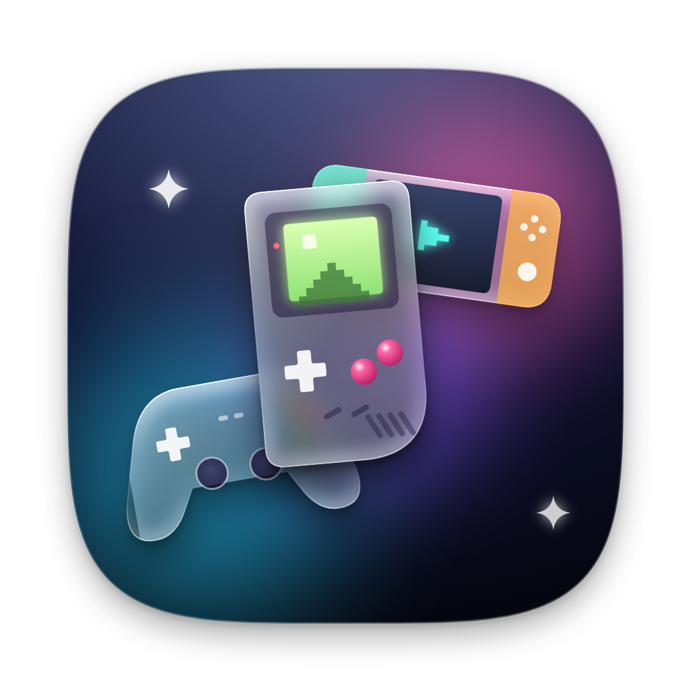
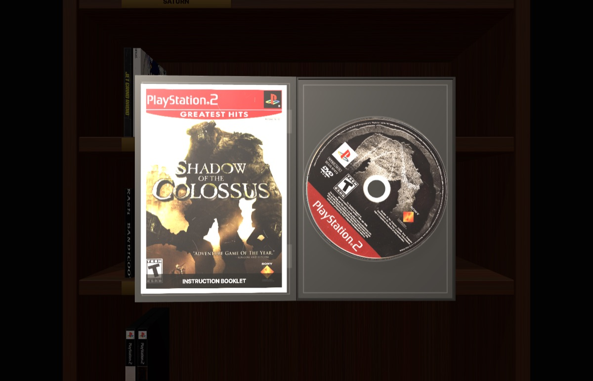
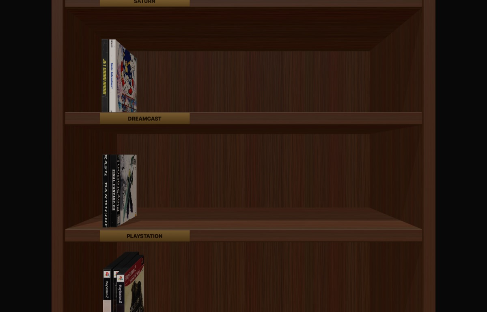

<div align="center">



# Cartridge

**Your retro game collection, on a shelf.**<br>
A native macOS launcher that installs the right emulator, finds the box art and lets you pull a game off a 3D shelf, open the case and read the manual.

[](https://github.com/nicholaslegit-sys/cartridge/actions/workflows/ci.yml)
[](https://github.com/nicholaslegit-sys/cartridge/releases/latest)
[](#requirements)
[](https://swift.org)
[](https://developer.apple.com/xcode/swiftui/)
[](#requirements)

[Download](https://github.com/nicholaslegit-sys/cartridge/releases/latest) · [Features](#features) · [Build from source](#build-from-source) · [Credits](#credits)

<br>



</div>

## Features

| | |
|---|---|
| **Game Shelf** | Every disc game stands on a 3D bookcase, grouped by console. Pick one up, turn it in your hands, open the case and watch the disc spin. |
| **Manuals** | Click the booklet to find the game's original instruction manual (Internet Archive, Musée des jeux vidéo, Digital Press) and page through it in 3D. |
| **Emulators, installed for you** | Cartridge downloads the official release of the emulator a game needs the first time you press Play, only from that project's own release page, and never replaces one with a build signed by somebody else. |
| **Artwork and trailers** | Box art, disc labels, spines and trailers from the LaunchBox Games Database, with optional IGDB lookup. |
| **Homebrew Store** | Browse and install free homebrew games from Homebrew Hub. |
| **Drag and drop** | Drop game files or whole folders on the window; the console is detected automatically. |
| **Setup, once** | First launch asks which consoles you run, sorts out the BIOS files they need and where your games should live. Everything after that shows only what you asked for. |
| **BIOS you can trust** | Cartridge won't hand you a console BIOS, but it checks the one you supply, tells you which revision it is, puts it where the emulator looks and remembers its fingerprint. |
| **Games folder** | Drop dumps into your games folder and they appear in the library the next time you switch back to Cartridge. Track files a `.cue` names stay part of their disc. |
| **Save backups** | Every emulator's saves, found where each one really keeps them, copied to iCloud Drive or a folder you choose after every game. The last ten copies are kept, and any of them can be put back. |
| **Dump check** | Compares your games with the No-Intro and Redump lists of known-good dumps, which catches the bad dump behind a game that won't boot. |
| **RetroAchievements, once** | Sign in once and RetroArch, DuckStation and PCSX2 all earn achievements on your account. |
| **Controllers** | See what's connected and exactly what each emulator needs, once, to use it. |
| **Update notice** | A newer Cartridge shows at the foot of the sidebar. |

<div align="center">

</div>

## Supported systems

| Emulator | Systems |
|---|---|
| [RetroArch](https://www.retroarch.com) | NES, SNES, Nintendo 64, Game Boy / Color / Advance, Nintendo DS, Master System, Genesis, Game Gear, Saturn, Atari 2600, TurboGrafx-16 |
| [DuckStation](https://github.com/stenzek/duckstation) | PlayStation |
| [PCSX2](https://pcsx2.net) | PlayStation 2 |
| [RPCS3](https://rpcs3.net) | PlayStation 3 |
| [shadPS4](https://shadps4.net) | PlayStation 4 |
| [PPSSPP](https://www.ppsspp.org) | PSP |
| [Dolphin](https://dolphin-emu.org) | GameCube, Wii |
| [Flycast](https://github.com/flyinghead/flycast) | Dreamcast |
| [Azahar](https://azahar-emu.org) | Nintendo 3DS |
| [xemu](https://xemu.app) | Xbox |

## Requirements

- macOS 14 Sonoma or later
- Apple silicon Mac (the release build is arm64)

## Install

1. Download `Cartridge-<version>.dmg` from the [latest release](https://github.com/nicholaslegit-sys/cartridge/releases/latest).
2. Open it and drag **Cartridge** onto **Applications**.
3. The build is ad-hoc signed rather than notarized, so macOS stops it the first time:
   - **macOS 14:** right-click the app → **Open**.
   - **macOS 15 or later:** try to open it, then allow it in **System Settings → Privacy & Security → Open Anyway**. Right-click → Open no longer works there.

## Build from source

```bash
git clone https://github.com/nicholaslegit-sys/cartridge.git
cd cartridge
./build-app.sh        # writes build/Cartridge.app
./.github/scripts/make-dmg.sh   # packs it into build/Cartridge-<version>.dmg, the drag-to-Applications installer
```

Run the tests with `swift test`. Network tests are opt-in (`CARTRIDGE_LIVE=1`, `CARTRIDGE_LIVE_LAUNCHBOX=1`, `CARTRIDGE_LIVE_MANUALS=1`, `CARTRIDGE_LIVE_TRAILERS=1`). `./.github/scripts/smoke-test.sh` launches the app you just built against a throwaway library and checks it comes up; CI runs the same script.

> [!NOTE]
> Building inside an iCloud-synced folder such as Desktop adds extended attributes that `codesign` rejects. `build-app.sh` handles this for the app. For tests, pass `--scratch-path` pointing outside the synced folder.

## Your games, your dumps

Cartridge never downloads commercial games, BIOS or firmware. Import dumps of games you own; the store only offers free, legally distributed homebrew.

### What the BIOS check actually does

Setup, and later **BIOS Files** in the sidebar, take the files you dumped from your own consoles and check them before an emulator ever sees them. The check reads the format rather than comparing against a list of known hashes, because published BIOS hash lists contradict each other and a baked-in table would reject a good dump of a model nobody wrote down:

- a **PlayStation** image has to be 512 KB and carry Sony's copyright and its `System ROM Version` line, which is read back to you as the revision, date and region;
- a **PS2** image has to have a ROM directory whose `ROMVER` entry spells out the version, region, retail-or-devkit and build date;
- a **Saturn** image has to be 512 KB and carry Sega's name;
- **MCPX**, Xbox flash, DS and Dreamcast images have to be exactly the sizes those chips are;
- a **PS3UPDAT.PUP** has to start with Sony's update header and be a plausible size for complete firmware.

What it is gets shown back to you, the file is copied into the folders DuckStation, PCSX2 and RetroArch read, and its SHA-256 is recorded so **Verify** can tell you later if it or a copy was damaged.

PS3 system software is the one piece Sony publishes for every owner, but its update endpoint serves a certificate belonging to a different host, so Cartridge links you to the download page and verifies the file you fetched rather than pulling binaries over a connection it cannot authenticate.

## Credits

**Author:** Nicholas Seymour

The shelf, cases and discs are drawn in code. They were modelled on these, used under [CC BY 4.0](https://creativecommons.org/licenses/by/4.0/):

- [PSX Style Wooden Bookshelf (Low Poly)](https://sketchfab.com/3d-models/psx-style-wooden-bookshelf-low-poly-bf8be00f3d344ebdafd701fb90d65497) by My Name Is This
- [Playstation 5 Case with Disc](https://sketchfab.com/3d-models/playstation-5-case-with-disc-1342a3134c3f4ed7aed3a3e230355ee3) by keltoncrane91

Artwork and data: [LaunchBox Games Database](https://gamesdb.launchbox-app.com), [IGDB](https://www.igdb.com), [libretro thumbnails](https://thumbnails.libretro.com), [Homebrew Hub](https://hh.gbdev.io), [Internet Archive](https://archive.org).

Game titles, box art and trademarks belong to their respective owners.

## License

Cartridge is released under the [MIT License](LICENSE).
